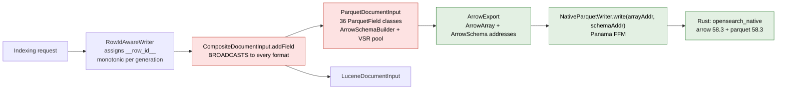
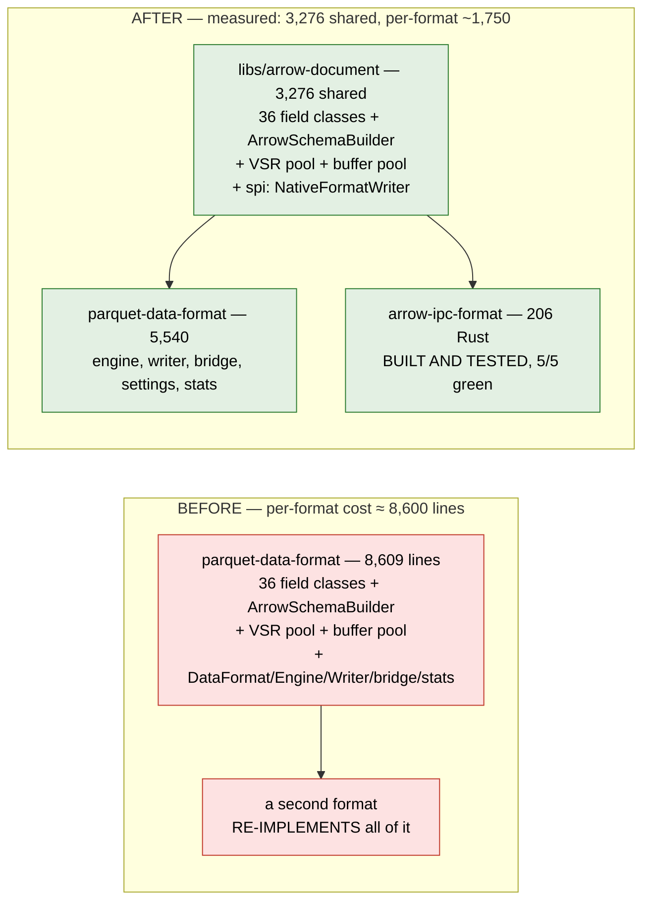

# Loon-like Storage Capabilities in Mustang: A Format Seam Design

**Status:** proposal, for review
**Goal:** let Mustang gain Milvus Loon's storage capabilities — above all, **cheap addition of new
storage formats** — with the smallest possible change to existing code.
**Verdict up front:** Mustang already has most of Loon's architecture. Two things are missing, and
neither requires linking Loon.

---

## 1. Summary

### The finding

Mustang and Loon converged on the same architecture. That is not a coincidence — the ColumnGroups
design cites Loon as its model. Comparing them component by component (§3), Mustang already has:

- a **shared row coordinate** (`__row_id__`, assigned monotonically by `RowIdAwareWriter`, remapped
  through `PackedRowIdMapping` when merge or flush-sort reorders rows) — the same positional model
  as Loon's global row index;
- a **versioned catalog** (`CatalogSnapshot`, `Writeable`, serialized to disk and wire) whose unit
  is `Segment(generation, Map<formatName, WriterFileSet>)` — structurally Loon's manifest with its
  column groups and `ColumnGroupFile(path, start_index, end_index)`;
- an **Arrow C Data Interface boundary already in production**: `NativeParquetWriter.write(long
  arrayAddress, long schemaAddress)` passes `ArrowArray*` / `ArrowSchema*` across FFI — byte-for-byte
  the same shape as Loon's `loon_writer_write(handle, ArrowArray*)`;
- **Panama FFM plumbing** (`NativeCall`, `ArrowExport`, `NativeLibraryLoader`) with documented Arena
  discipline;
- an **object-store filesystem layer** (`native-repository-{s3,gcs,azure,fs}`, `tiered-storage`,
  `block-cache-foyer`);
- **multi-format-per-shard hosting** (`CompositeIndexingExecutionEngine`, `CompositeMergeExecutor`).

### The two real gaps

| Gap | Evidence | Consequence |
|---|---|---|
| **No format seam.** The Arrow-producing machinery is entangled with the one format that consumes it. | `plugins/parquet-data-format` is 8,609 lines of non-test Java, of which 36 classes are `ParquetField` implementations plus `ArrowFieldRegistry` / `ArrowSchemaBuilder` / VSR management — **all format-independent work living inside a format plugin**. | A second format re-pays that cost. |
| **No field→format routing.** | `CompositeDocumentInput.addField` calls `primaryDocumentInput.addField` and then loops over **every** secondary. There is no routing table, no `column_group` attribute consumed. | Multi-format shards are whole-document dual-writes, not column groups. Loon's write-amplification win is unreachable. |

### Why not simply link Loon

Loon ships as a C++ shared library. Linking it into the OpenSearch JVM means importing C++ Arrow
17, Folly, the AWS/Azure/GCP C++ SDKs, avro, glog, protobuf, gRPC, OpenTelemetry — and
`milvus-common`, which `cpp/CMakeLists.txt` requires unconditionally. Mustang's native side is a
**single Rust `cdylib`** (`opensearch_native`) built from one Cargo workspace pinned to
`arrow = 58.3.0` and `datafusion = 54.0.0`. Full analysis in §4; the short version is that the
"minimize code changes" constraint points the other way.

### The recommendation

**Port Loon's seam, not Loon's binary.** Three changes, in dependency order:

| # | Change | Size | Unlocks |
|---|---|---|---|
| 1 | Extract the format-agnostic Arrow document pipeline out of `parquet-data-format` into a shared library | one refactor, mostly file moves; **measured at 3,276 lines shared** | every later format stops re-paying the mapping-to-Arrow pipeline |
| 2 | Add a Rust `FormatWriter`/`FormatReader` trait pair with name-based dispatch, mirroring Loon's `Format` factory | **measured at 290 lines Rust** + the Java seam interfaces | a new format becomes a Rust crate plus a thin `DataFormat` |
| 3 | Add field→format routing to `CompositeDocumentInput` | ~200 lines | column groups, and with them per-format lifecycle isolation |

Changes 1 and 2 have been **built and measured** on `poc/loon-format-seam`. A second format's
native half came out at **206 lines** (a complete, tested Arrow IPC format); the Java half is
projected at ~1,550. So a new format costs **≈1,750 lines against an 8,609-line baseline — a 4.9×
reduction, not the 9.5× an earlier draft of this document claimed** (§7, §11). The change is
additive: no existing format changes behaviour.

---

## 2. What Mustang has today

A format plugin implements `DataFormatPlugin`, which yields a `DataFormat` (name, priority,
`supportedFields`) and an `IndexingExecutionEngine<T, P>`:

```java
public interface IndexingExecutionEngine<T extends DataFormat, P extends DocumentInput<?>> {
    Writer<P> createWriter(WriterConfig config);
    Merger getMerger();
    RefreshResult refresh(RefreshInput refreshInput);
    long getNextWriterGeneration();
    T getDataFormat();
    long getHeapBytesUsed();  long getNativeBytesUsed();
    Map<String, Collection<String>> deleteFiles(Map<String, Collection<String>> filesToDelete);
    P newDocumentInput();
    IndexStoreProvider getProvider();          // may return null — Parquet does
    default FormatChecksumStrategy getChecksumStrategy() { return null; }
    default Map<DataFormat, EngineReaderManager<?>> buildReaderManager(ReaderManagerConfig c) {...}
    default long maxIndexableDocs() { return Long.MAX_VALUE; }
}
```

The write path per document:



Green is reusable as-is by any Arrow-fed format. Red is where the two gaps sit: the broadcast in
`CompositeDocumentInput`, and the fact that everything in `ParquetDocumentInput`'s box is
format-independent but lives in a format plugin.

Flush and merge exchange plain records:

| Contract | Shape |
|---|---|
| `Writer.flush(FlushInput)` | → `FileInfos(Map<DataFormat, WriterFileSet>, RowIdMapping)` |
| `WriterFileSet` | `(directory, writerGeneration, Set<String> files, numRows, formatVersion)` |
| `Segment` | `(generation, Map<String formatName, WriterFileSet>)`, `Writeable` |
| `Merger.merge(MergeInput)` | `MergeInput(segments, rowIdMapping, newWriterGeneration)` → `MergeResult(Map<DataFormat, WriterFileSet>, RowIdMapping)` |
| `CatalogSnapshot` | versioned, `getSegments()`, `getSearchableFiles(format)`, `getDataFormats()`, `serializeToString()` |

The read path: `DatafusionReader(directoryPath, Collection<WriterFileSet>, NativeStoreHandle,
sortFields, sortOrders)` narrows each file set to a `MonoFileWriterSet` — **one file per segment,
fail-fast otherwise** — and hands it to a native `ReaderHandle`.

---

## 3. Loon ↔ Mustang: the component mapping

| Concern | Loon | Mustang | Assessment |
|---|---|---|---|
| Cross-format join key | global row index (int64, positional, shared by all column groups) | `__row_id__` via `RowIdAwareWriter`; `DocumentInput.ROW_ID_FIELD` | **same model, same name** |
| Reordering after compaction | positions rewritten; manifest republished | `PackedRowIdMapping` (packed old↔new, per generation) | **Mustang is more explicit** |
| Versioned metadata | `Manifest` (Avro, `manifest-N.avro`), conditional-PUT commit | `CatalogSnapshot` (`Writeable`, versioned, `serializeToString`) | **same role**; commit substrate differs (object-store CAS vs. shard-local) |
| Unit of data | `ColumnGroup{columns, format, files[ColumnGroupFile(path, start_index, end_index)]}` | `Segment(gen, Map<formatName, WriterFileSet(dir, gen, files, numRows, formatVersion)>)` | **isomorphic**; `numRows` ↔ `end_index − start_index` |
| Field partitioning | 3 policies (`single`, `schema_based`, `size_based`) | **broadcast only** — no routing | **gap 2** |
| Format abstraction | `Format` factory + `FormatReader`/`FormatWriter`; `Format::get(name)` dispatches 5 formats | `DataFormatPlugin` per format, ~8.6k lines each | **gap 1** |
| Data boundary | Arrow C Data Interface (`ArrowArray*`) | Arrow C Data Interface (`ArrowExport` + address passing) | **already identical** |
| Object storage | `FileSystemProxy`, 6 clouds, `extfs.*` external tables | `native-repository-*`, `tiered-storage`, `block-cache-foyer` | **already there** |
| Independent per-format merge | per-column-group merge, independent cadence | `CompositeMergeExecutor`, `MergePlan`, `FormatMergeResult` | **partial** — exists, but pointless without routing |
| Predicate pushdown | Vortex zonemaps | DataFusion planner | different mechanism, both present |
| Runtime configuration | `Properties` registry (64 keys, typed + validated) | OpenSearch index settings | equivalent |

Read that table as: **eight of eleven rows are already done.** The design below addresses rows 6
and 5 (in that order), because row 6 is what makes every subsequent format cheap.

---

## 4. Why linking Loon is the larger change, not the smaller one

Both options were costed. This section records the rejection so it is not re-litigated.

| Dimension | Link `libmilvus-storage.so` | Port the seam (recommended) |
|---|---|---|
| New native dependencies in the OpenSearch JVM | C++ Arrow 17, Folly, AWS/Azure/GCP C++ SDKs, avro, glog, gflags, protobuf, gRPC, OpenTelemetry, **`milvus-common`** | none — extends the existing Rust workspace |
| Arrow runtimes in-process | 2 (C++ Arrow 17 **and** Rust arrow 58.3) | 1 |
| Build system | Conan 2 + CMake alongside Gradle + Cargo; Loon's deps are custom Conan packages on a Zilliz Artifactory remote | unchanged |
| Known linkage hazards | Loon's own `conanfile.py` documents an `aws-c-common` allocator abort requiring `aws-c-*/*:shared=True`, and an `xz_utils` static-linking failure — both would land inside the OpenSearch process | none |
| Non-negotiable coupling | `find_package(milvus-common REQUIRED)` is unconditional; brings `milvus::SegcoreError` and the `cachinglayer` translator contract | none |
| Formats obtained | 5 immediately, via a property string | 1 per crate added, but each is small (§7) |
| Read path | Loon's reader must feed DataFusion through an Arrow stream; Loon's own `rust/` DataFusion `TableProvider` is prior art but has no CI | native Rust crates plug into DataFusion directly |

The link option's one genuine advantage — five formats for one property change — is real. It is
outweighed by importing a second Arrow runtime and a foreign build system into a shard's address
space. **What Loon actually contributes here is its architecture, which Mustang can adopt without
its binary.** The rest of this document is that adoption.

> If the five-formats-at-once argument later wins, the escape hatch is narrow and worth recording:
> run Loon **out of process** behind its `ffi_filesystem_c.h` / external-table surface for
> read-only external tables only, where dependency isolation is a process boundary rather than a
> link-order problem. That is a separate proposal.

---

## 5. Change 1 — extract the format-agnostic Arrow document pipeline

**The diagnosis.** Of `parquet-data-format`'s 8,609 non-test lines, 3,276 turned out to be
format-agnostic (measured — §7). The parts genuinely about Parquet are `ParquetIndexingEngine` (391), `ParquetWriter` (268), `ParquetDocumentInput` (111),
the merge strategy, and the Rust writer. Everything else converts **OpenSearch mappings and values
into Arrow**:

- 36 `ParquetField` implementations (`BinaryParquetField`, `DateParquetField`, `KeywordParquetField`,
  `IdParquetField`, `RoutingParquetField`, …) — each is a `MappedFieldType` → Arrow vector writer;
- `ArrowFieldRegistry`, `ArrowSchemaBuilder` — mapping → `ArrowSchema`;
- `vsr/` (`ManagedVSR`, `VSRManager`, `VSRPool`, `VSRState`) and `memory/ArrowBufferPool` — batch
  accumulation and buffer reuse.

None of that mentions Parquet semantics. It is the OpenSearch→Arrow adapter, and it is exactly the
layer Loon does **not** have to duplicate per format.

**The change.** Move it into a shared library — `libs/arrow-document` is the natural home next to
the existing `libs/dataformat-native` — and re-export it. `parquet-data-format` keeps its
`DataFormat`, engine, writer, merge strategy, stats, and settings, and depends on the new library
for everything else.



**Risk.** This is a refactor of code on the write hot path. It must be behaviour-preserving, proven
by the existing `parquet-data-format` and `composite-engine` test suites passing unchanged — no new
test should be needed for change 1, and needing one is a signal the move was not pure.

**Why it comes first.** Every later format's cost estimate depends on it. Skipping it and adding a
second format directly is the outcome this design exists to prevent.

---

## 6. Change 2 — a Rust format seam mirroring Loon's `Format` factory

**What Loon does.** One abstract factory, name-based dispatch, five implementations behind it:

```cpp
arrow::Result<Format*> Format::get(const std::string& format) {
  static ParquetFormat parquet_fmt;   static VortexFormat vortex_fmt;
  static LanceFormat  lance_fmt;      static IcebergFormat iceberg_fmt;
  static PaimonFormat paimon_fmt;
  if (format == LOON_FORMAT_PARQUET) return &parquet_fmt;   // …
  return arrow::Status::Invalid("Unknown file format: " + format);
}
```

Each implementation provides `explore` (discover files in a directory), `create_reader`, and
`create_writer`. Loon additionally has `PlainFormat`, a base class for single-file formats that
handles URI resolution and filesystem lookup so a subclass implements only `make_reader` /
`make_writer`. **That base class is the reason a new single-file format in Loon is small.**

**The Mustang equivalent.** In `libs/dataformat-native/rust`, add:

```rust
pub trait FormatWriter: Send {
    /// Consume one Arrow batch handed over via the C Data Interface.
    fn write_batch(&mut self, array: *mut ArrowArray, schema: *mut ArrowSchema) -> Result<()>;
    fn flush(&mut self) -> Result<FlushedFiles>;   // paths + row counts + format version
    fn close(&mut self) -> Result<FlushedFiles>;
}

pub trait FormatReader: Send {
    /// Return an Arrow stream over the given files, with an optional projection.
    fn open(&self, files: &[FileRef], projection: Option<&[usize]>) -> Result<ArrowArrayStream>;
    fn row_count(&self, file: &FileRef) -> Result<u64>;
}

pub trait Format: Send + Sync {
    fn name(&self) -> &'static str;
    fn writer(&self, cfg: &WriterCfg) -> Result<Box<dyn FormatWriter>>;
    fn reader(&self) -> Result<Box<dyn FormatReader>>;
}

pub fn format_for(name: &str) -> Result<&'static dyn Format>;   // the dispatch
```

`ParquetFormat` becomes the first implementation, wrapping the code already in
`plugins/parquet-data-format/src/main/rust`. The existing FFI entry points keep their signatures —
they gain a format-name parameter and route through `format_for`.

Java side: one `LoonStyleIndexingEngine` base class in the new shared library implementing the
mechanical parts of `IndexingExecutionEngine` (generation counter, heap/native accounting,
`deleteFiles`, `newDocumentInput`, `getProvider() → null`, reader-manager delegation), so a concrete
format supplies only its `DataFormat` and its native handle type.

**Two deliberate borrowings from Loon, both cheap and both worth taking now:**

1. **Pre-known file size and footer size in the file set.** Loon stores `file_size` and
   `footer_size` as `ColumnGroupFile` properties specifically to skip an object-store HEAD and read
   a footer in a single GET. `WriterFileSet` already carries `numRows` and `formatVersion`; adding
   these two is a small extension with a direct latency payoff on remote reads.
2. **`explore` for external files.** Loon's `Format::explore(dir, properties)` discovers files this
   library did not write, which is what makes external tables possible. Putting it on the trait now
   costs nothing and keeps the door open.

---

## 7. What a new format costs after changes 1 and 2

> **Measured, not estimated.** The numbers below come from executing changes 1 and 2 in the
> `poc/loon-format-seam` worktree. **They correct this document's earlier estimate**, which was too
> optimistic — see §11.

Executing the extraction split `parquet-data-format` as follows:

| Module | Files | Lines | Reusable by another format? |
|---|---|---|---|
| `libs/arrow-document` (new, shared) | 52 | **3,276** | yes — the whole mapping-to-Arrow pipeline |
| `plugins/parquet-data-format` (after) | 34 | **5,540** | no — Parquet's engine, writer, bridge, settings, stats, store |
| *baseline before the split* | *81* | *8,609* | |

The extraction moves **38%** of the plugin into shared code, not the ~90% an earlier draft implied.
What stays, and whether a new format re-pays it:

| What stays | Lines | Re-paid by a new format? |
|---|---|---|
| `ParquetSettings` | 962 | its own, but much smaller — row-group/encoding/dictionary knobs are Parquet's |
| `bridge/RustBridge` | 860 | **no, after change 2** — it is the generic FFM binding; name-based native dispatch shares it |
| `stats/**` (13 files) | ~1,320 | **no** — a new format can start with `ArrowIngestStats.NOOP` |
| `store/**` (3 files) | 395 | **no** — tiered storage and store handling are generic |
| `bridge/NativeSettings`, `MergeFilesResult` | 381 | **no** — allocator settings and merge results are generic |
| `engine/` + `ParquetDataFormat` | 464 | **yes** |
| `writer/ParquetWriter` | 268 | **yes** |
| `bridge/NativeParquetWriter` | 179 | **yes**, but now a thin `NativeFormatWriter` impl |
| `merge/**` | 203 | **yes** for the strategy |
| plugin registration + index-creation validator | 452 | **yes**, mechanical |

### The measured cost of a second format

| Piece | Measured | Notes |
|---|---|---|
| Native half — a complete, queryable format | **206 lines Rust** | `arrow-ipc-format`, production code only, plus 101 lines of tests |
| The seam itself, paid once | 290 lines Rust | `format-seam`: traits, value types, name dispatch |
| Java half — engine, writer, native-writer impl, merge strategy, plugin, own settings | **≈ 1,550 lines** | projected from the Parquet files a new format must still write; not built in the prototype |
| Document input, schema building, VSR pooling, buffer pooling, row-id assignment, catalog, refresh, replication, snapshot, tiering | **0** | inherited — verified by the extraction |

**Honest total: ≈ 1,750 lines for a new format against an 8,609-line baseline — a 4.9× reduction,
not the 9.5× claimed earlier.** The native half came out *better* than estimated (206 vs ~350); the
Java half worse, because extraction alone shares less than assumed and the rest of the saving
depends on change 2 generalising the native bridge plus sharing the stats and store scaffolding.

**Constraint to state plainly:** `MonoFileWriterSet` assumes **one file per segment**. Loon's
column-group writers can emit several. Phase 1 therefore keeps one file per segment per format —
in Loon's vocabulary, `writer.policy=single`. Multi-file sets are change 3 territory.

---

## 8. Change 3 — field→format routing, and thereby column groups

Today `CompositeDocumentInput.addField` broadcasts:

```java
public void addField(MappedFieldType fieldType, Object value) {
    primaryDocumentInput.addField(fieldType, value);
    for (Map.Entry<DataFormat, DocumentInput<?>> e : secondaryDocumentInputs.entrySet()) {
        e.getValue().addField(fieldType, value);      // every field to every format
    }
}
```

**The change.** Resolve each field to its owning format once, from a mapping attribute, and route
instead of broadcast — keeping a broadcast set for the fields every format needs (`__row_id__`, and
whatever identity/metadata each format requires). This is deliberately the same shape as Loon's
column-group policies: a default that puts everything in one group, plus an explicit assignment.

What it unlocks, in Loon's terms:

| Capability | Mechanism after change 3 |
|---|---|
| Column groups | a `Segment`'s `Map<formatName, WriterFileSet>` becomes a genuine field partition rather than N copies |
| Write-amplification isolation | rewriting one field set no longer rewrites the others — the entire point of Loon's design |
| Independent per-format merge cadence | `CompositeMergeExecutor` becomes meaningful; today merging a format that holds a copy of everything saves nothing |
| Schema evolution without rewrite | add a field → new format/group; drop a field → remove it from its group |
| Mixed formats by access pattern | text fields in one format, analytics fields in another, chosen per field |

**Ordering matters.** Change 3 is where the correctness questions live — the shared `__row_id__` must
stay aligned across groups that now flush independently, which is precisely the invariant
`PackedRowIdMapping` exists to maintain and which Loon validates at three separate layers. It should
land after changes 1 and 2 are in production, not alongside them.

---

## 9. Non-goals

- **Do not link `libmilvus-storage.so` into the OpenSearch JVM.** §4.
- **Do not adopt Loon's manifest as a second catalog.** `CatalogSnapshot` stays the single source of
  truth. Two versioned catalogs over the same data is a torn-visibility bug waiting to happen, and
  Loon's own design spends a whole section on the atomic-publication invariant needed to avoid it.
- **Do not change the `__row_id__` model.** Mustang's positional row id plus an explicit remap table
  is a legitimate design point, and it is already implemented and tested.
- **Do not fold change 3 into changes 1–2.** Each phase should introduce one new variable.

---

## 10. Validation

| # | What | How | Gate |
|---|---|---|---|
| 1 | Change 1 is behaviour-preserving | existing `parquet-data-format` + `composite-engine` suites pass **unchanged**; needing a new test signals an impure move | no regression |
| 2 | The format seam is neutral for Parquet | route Parquet through `format_for("parquet")`; compare flush/merge byte counts and ingest throughput against the pre-change build | ±3% throughput |
| 3 | A second format works end to end | index → refresh → query a Vortex-backed index through DataFusion via the Arrow stream path | correctness first, then latency |
| 4 | `__row_id__` alignment survives independent flush (change 3 only) | flush formats at different cadences, then assert cross-format joins resolve the same logical documents | hard gate |
| 5 | Native memory accounting | `getNativeBytesUsed` per format under the existing native-memory stats | within the current envelope |

Item 3 should be attempted **before** change 3, on a single-format index, so the read-path mechanism
is proven independently of routing.

---

## 11. Prototype findings

Changes 1 and 2 were built on this branch. Three findings changed the design's claims.

**1. The extraction shares 38%, not ~90%.** An earlier draft asserted roughly 7,700 of 8,609 lines
were format-agnostic. Measured: 3,276. The misjudgement came from counting the 36 field classes and
the VSR machinery — which *are* agnostic, and did move — while overlooking that settings, stats,
store handling and the native FFM binding, together over 3,500 lines, also live in the plugin. §7
now carries measured numbers.

**2. `VSRManager` was the real coupling point, and inverting it is what makes the pipeline
shareable.** It orchestrates Arrow batching into file generation and hard-referenced
`NativeParquetWriter`, `ParquetShardStatsTracker`, `ParquetFileMetadata`, `ParquetSortConfig` and
the Parquet thread-pool name. Introducing `NativeFormatWriter`, `ArrowIngestStats`,
`FormatFileMetadata` and `FormatSortConfig` — and *injecting* the writer and thread-pool name rather
than constructing them inside — moved 472 lines of VSR code into shared use. Without that inversion
the extraction stalls at the `fields/` package and shares only ~1,700 lines.

**3. The native half of a format is genuinely cheap — 206 lines.** `arrow-ipc-format` is complete:
it writes, reads, projects, reports row counts and file size, and correctly reports "no reorder" so
the engine does not build a row-id remap. Arrow IPC was chosen because `arrow-ipc` is *already* a
workspace dependency — the Parquet writer stages through `.arrow_ipc_staging` files — which isolates
the seam question from the dependency question. Vortex or Lance is the same glue plus a real
third-party crate.

The seam holds. The cost claim needed halving.

---

## Appendix A — Source verification

All claims about current behaviour were read from source rather than inferred.

| Claim | Location |
|---|---|
| The format SPI surface | `server/.../index/engine/dataformat/IndexingExecutionEngine.java`, `DataFormat.java`, `DataFormatPlugin.java`, `Writer.java`, `DocumentInput.java`, `WriterConfig.java` |
| `getProvider()` may be null for Parquet | `IndexingExecutionEngine.getProvider()` javadoc: "Engines that do not manage a store (e.g., Parquet) may return `null`" |
| Shared row coordinate | `DocumentInput.ROW_ID_FIELD = "__row_id__"`; `RowIdAwareWriter.addDoc` calls `d.setRowId(ROW_ID_FIELD, rowIdCounter.getAndIncrement())` and decrements on `WriteResult.Failure` |
| Row-id remapping | `RowIdMapping` (`getNewRowId`, `getOldRowId`, `SINGLE_GEN`), `PackedRowIdMapping` (`PackedLongValues` forward + optional reverse, per-generation offsets) |
| Flush/merge contracts | `FileInfos(Map<DataFormat, WriterFileSet>, RowIdMapping)`, `WriterFileSet(directory, writerGeneration, files, numRows, formatVersion)`, `MergeInput`/`MergeResult`, `RefreshInput`/`RefreshResult` |
| Catalog | `exec/coord/CatalogSnapshot.java` — `getSegments`, `getSearchableFiles(String)`, `getDataFormats`, `serializeToString`, `getVersion`; `Segment(long generation, Map<String, WriterFileSet>)` is `Writeable` |
| Arrow C Data Interface already crosses FFI | `NativeParquetWriter.write(long arrayAddress, long schemaAddress)`; `libs/dataformat-native/.../spi/ArrowExport.java` returns `getArrayAddress()` / `getSchemaAddress()` |
| Native calls are Panama FFM | `libs/dataformat-native/.../spi/NativeCall.java` — documents `java.lang.foreign.SymbolLookup`, per-call and global Arena discipline |
| One Rust cdylib, one workspace | `libs/dataformat-native/rust/Cargo.toml` — 11 workspace members including the Parquet, DataFusion, repository, tiered-storage and block-cache crates; `lib/Cargo.toml` → `name = "opensearch_native"`, `crate-type = ["cdylib"]` |
| Pinned Rust deps | `arrow = "=58.3.0"` with `features = ["ffi"]`, `parquet = "=58.3.0"`, `datafusion = "=54.0.0"` |
| **No field routing** | `CompositeDocumentInput.addField` → `primaryDocumentInput.addField` then a loop over `secondaryDocumentInputs`; no routing/`column_group` reference anywhere in the file |
| Per-format cost | `plugins/parquet-data-format`: 8,609 non-test non-benchmark Java lines; 36 classes under `fields/`; `ParquetIndexingEngine` 391, `ParquetWriter` 268, `ParquetDocumentInput` 111 |
| Read path assumes one file per segment | `DatafusionReader` javadoc: "Each `WriterFileSet` is narrowed to a `MonoFileWriterSet` — Parquet produces exactly one file per segment. This fails fast if a multi-file set is encountered" |

### Loon facts used, and where they came from

Taken from the milvus-storage maintainer knowledge base at
`/workplace/ltjin/maintainers/milvus-io/kb/milvus-storage/`, which is itself source-verified against
milvus-storage `main` @ `e759b53`:

| Loon fact | KB reference |
|---|---|
| `Format::get(name)` dispatches 5 formats; `PlainFormat` base for single-file formats | `04-formats/README.md` |
| `loon_writer_write(handle, ArrowArray*)`; Arrow C Data Interface at the boundary | `06-ffi-bindings.md` |
| `ColumnGroupFile(path, start_index, end_index, properties)`; `file_size` / `footer_size` skip a HEAD and enable a single-GET footer read | `02-data-model.md`, `04-formats/parquet.md` |
| Column-group policies `single` / `schema_based` / `size_based` | `01-architecture.md`, `10-properties-reference.md` |
| Manifest + optimistic transaction, conditional-PUT commit, atomic publication | `03-transactions.md` |
| `milvus-common` is an unconditional dependency (`find_package(... REQUIRED)`) | `09-ecosystem.md` |
| C++ Arrow 17.0.0 custom Conan package; internal Rust bridge carries arrow 56.2 **and** arrow58 | `07-build-test.md`, `04-formats/rust-bridge.md` |
| `aws-c-common` allocator abort requiring shared linkage; `xz_utils` static-linking failure | `07-build-test.md` |
| Loon's own DataFusion `TableProvider` crate exists but has no CI | `06-ffi-bindings.md` |

### Measured in the prototype

Changes 1 and 2 were executed on this branch (`poc/loon-format-seam`, branched from `main` at
`f81134c7c2f`).

| Result | Value |
|---|---|
| Extraction split | 3,276 shared / 5,540 format-specific lines, from an 8,609 baseline |
| Structural check after the refactor | 84 files — every package matches its path, every type name matches its filename, every internal import resolves |
| `cargo check`, new crates | clean |
| `cargo test`, new crates | **5/5 pass** — 2 registry, 3 Arrow IPC (round-trip, projection, empty generation) |
| `cargo check`, pre-existing `opensearch-parquet-format` | still clean; its one warning is pre-existing in untouched `ffm.rs` |
| Second format, native half | 206 production lines |

### Still unverified

- **No Gradle compile and no cluster run.** The Java side is structurally consistent but
  uncompiled; that needs `-Dsandbox.enabled=true` on JDK 25 plus the native library build.
- **The ≈1,550-line Java figure for a new format is a projection**, from which Parquet files a new
  format must write its own version of. Building `arrow-ipc-data-format`'s Java half would confirm it.
- **The read path is untouched.** `DatafusionReader` still narrows to `MonoFileWriterSet` and hands
  paths to a native Parquet opener. Registering a `FormatReader` stream as a DataFusion table
  provider — §7's one genuinely new mechanism — is not prototyped.
- **Test migration was deliberately skipped.** Tests exercising moved classes stay in
  `parquet-data-format` with rewritten imports. That satisfies "existing suites pass unchanged" but
  leaves them in the wrong module; moving them needs Gradle test-fixtures wiring.
- **Change 3 (field routing) is not prototyped at all.**
